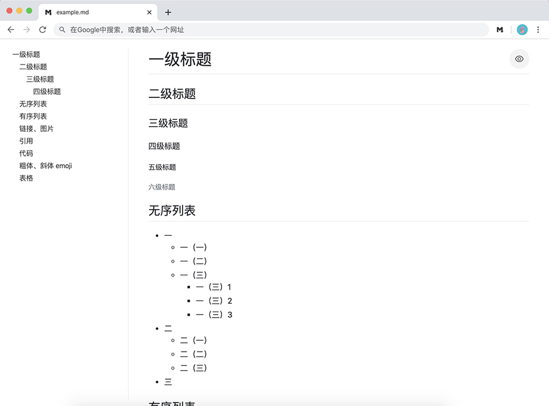

# md-reader

一个使 chrome 可以预览 markdown 文件的浏览器扩展。

[English](https://github.com/Heroor/md-reader) | 中文

> 支持 `file://` `http://` `https://` 三种协议与 `.md` `.markdown` 两种文件扩展名。



下面是两个 markdown 文件地址的例子:

`https://***.md`

`file://***.markdown`


## 安装插件

### 在线安装（需要科学上网）

点击[这里](https://chrome.google.com/webstore/detail/medapdbncneneejhbgcjceippjlfkmkg/publish-accepted) 可以在 chrome 扩展商店直接安装。

### 本地安装

1. 首先下载这个项目:

```bash
$ git clone https://github.com/Heroor/md-reader.git
```

2. 打开 Chrome 浏览器 -> 菜单 -> 更多工具 -> 扩展程序

3. 开启 `开发者模式`。

4. 点击 `加载已解压的扩展程序` 按钮，然后选择刚刚下载的项目文件夹。

5. 最后一步，此时我们已经可以预览在线的 markdown 文件了，但是预览本地文件还不行，我们需要开启访问本地 markdown 文件的权限：
    > 由于 chrome 出于安全考虑，限制了插件对本地文件的访问，默认是关闭状态，所以我们需要手动开启插件访问本地文件的权限，这样就可以正常预览本地的 markdown 文件了

    还是在插件管理界面中，找到我们的 `md-reader` 插件，点击 `详细信息` 按钮，在下边找到 `允许访问文件网址`，然后开启选项。

ヾ(◍°∇°◍)ﾉﾞ 这样就大功告成啦~！

<br/>

打开这个链接试一下效果吧：[https://raw.githubusercontent.com/Heroor/md-reader/master/example.md](https://raw.githubusercontent.com/Heroor/md-reader/master/example.md)

或者直接将 markdown 文件 **拖进浏览器** 试试吧~(￣▽￣)~


<br/>
<br/>
<br/>
<br/>


如有问题请随时提问~ 喜欢记得点star哦~

Bener 献上(◕ˇ∀ˇ◕)
