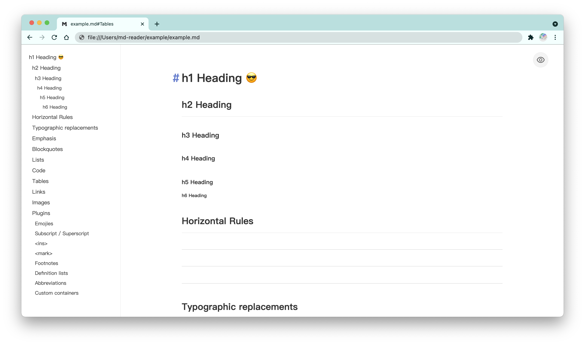
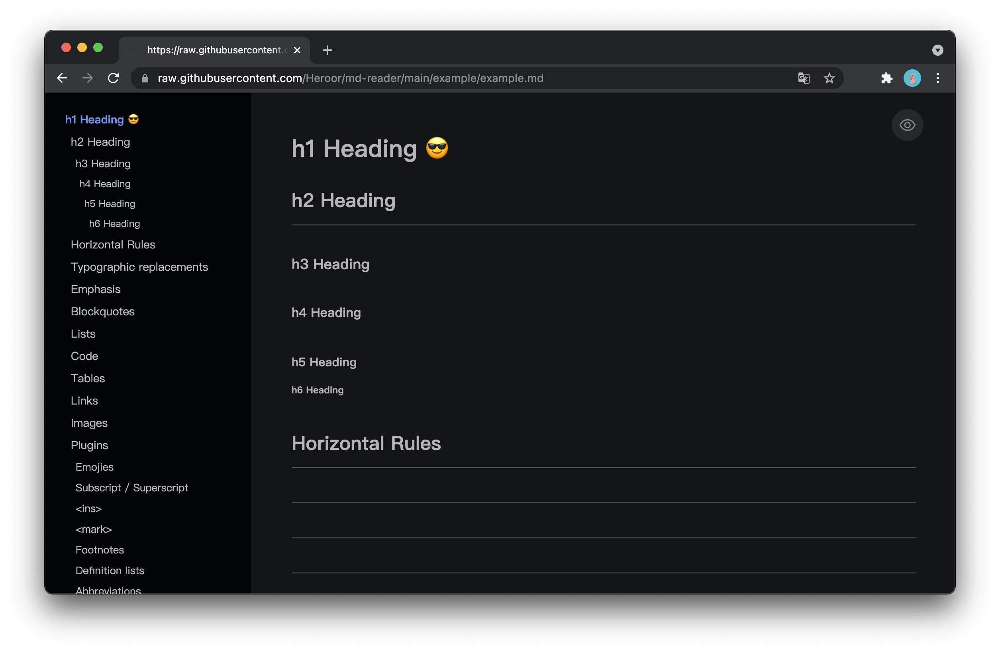

# md-reader


[English](./README.md) | 中文 | [한국어](./README-ko.md)

[](https://chrome.google.com/webstore/detail/md-reader/medapdbncneneejhbgcjceippjlfkmkg) [](https://chrome.google.com/webstore/detail/md-reader/medapdbncneneejhbgcjceippjlfkmkg) [](https://chrome.google.com/webstore/detail/md-reader/medapdbncneneejhbgcjceippjlfkmkg)

一个可以使 Chrome 预览 markdown 文件的扩展程序。

> 支持浏览 `file://` `http://` `https://` 链接以及 `*.md` `*.mkd` `*.markdown` 扩展名文件。

就像下面的样子:

- `https://example.com/example.md`
- `file:///Users/my-project/readme.markdown`





## 安装

### A. 在线安装（需要机智上网）

在 [Chrome 扩展商店](https://chrome.google.com/webstore/detail/md-reader/medapdbncneneejhbgcjceippjlfkmkg) 直接安装。

### B. 本地构建

1. 克隆 `md-reader` 仓库到本地并编译:

    ```bash
    # 克隆本仓库
    git clone https://github.com/Heroor/md-reader.git && cd md-reader

    # 安装依赖
    pnpm install

    # 构建扩展程序
    pnpm build
    ```

2. 构建成功后，`md-reader/dist` 文件夹会生成 `md-reader-xxx.zip` 扩展程序包。

3. 进入 Chrome 的扩展管理页，将扩展程序拖拽进浏览器即可安装。

## 使用

安装完成后，此时 Chrome 已经可以预览在线的 markdown 文件了，但是还不可以预览本地的 markdown 文件，需要开启 Chrome 扩展的本地文件访问权限：

> 由于 Chrome 出于安全考虑，默认关闭了扩展程序对本地文件的访问权限，所以在安装完插件后需要手动开启权限，这样就可以正常预览本地 markdown 文件了。

**开启权限**：在扩展程序管理页中，找到刚刚安装的 `md-reader`，点击 `详细信息`，在详情页找到 `允许访问文件网址` 选项，然后切换为开启状态即可（请放心：`md-reader` 只对 markdown 文件进行读取和展示的操作，不会修改和上传用户文件数据）。

<br/>

这样就大功告成啦~！ヾ(◍°∇°◍)ﾉ

打开这个在线文件试一下效果吧：[example.md](https://raw.githubusercontent.com/Heroor/md-reader/main/example/example.md)，或者直接将 markdown 文件 **拖进浏览器** 试试！

如有使用问题请提出，欢迎 Star~

## 开发

```bash
# 克隆本仓库
git clone https://github.com/Heroor/md-reader.git && cd md-reader

# 安装依赖
pnpm install

# 启动开发环境
pnpm dev
```

在 Chrome 扩展程序管理页，点击“加载已解压的扩展程序”，选择 `md-reader/extension` 目录即可。

## 协议

License [MIT](https://github.com/Heroor/md-reader/blob/master/LICENSE)

© 2018-present, [Bener](https://github.com/Heroor)
