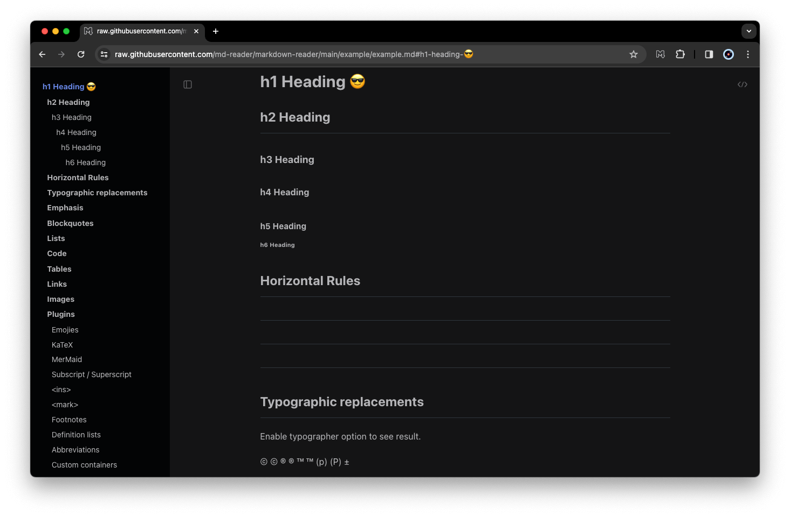

# md-reader


[English](./README.md) | [中文](./README-cn.md) | 한국어

[](https://chrome.google.com/webstore/detail/md-reader/medapdbncneneejhbgcjceippjlfkmkg) [](https://chrome.google.com/webstore/detail/md-reader/medapdbncneneejhbgcjceippjlfkmkg) [](https://chrome.google.com/webstore/detail/md-reader/medapdbncneneejhbgcjceippjlfkmkg)

크롬을 위한 마크다운 리더 확장 프로그램.

> `file://` `http://` `https://` URL 및 `*.md` `*.mkd` `*.markdown` 확장 파일을 지원합니다.

예시:

- `https://example.com/example.md`
- `file:///Users/my-project/readme.markdown`




## 설치

### A. 온라인

[Chrome 웹 스토어](https://chrome.google.com/webstore/detail/md-reader/medapdbncneneejhbgcjceippjlfkmkg)에서 설치하세요.

### B. 로컬

1. 이 저장소를 Clone한 후 빌드하세요:

   ```bash
   # Clone repository
   git clone https://github.com/Heroor/md-reader.git && cd md-reader

   # Install dependencies
   pnpm install

   # Building extension zip
   pnpm build
   ```

2. 빌드가 성공하면 `md-reader/dist` 폴더가 `md-reader-xxx.zip` 확장 패키지를 생성합니다.

3. Chrome 의 확장 프로그램 관리 페이지로 이동하여 확장 프로그램을 브라우저에 끌어다 놓습니다.

## 사용법

설치 후 로컬 파일을 미리 보려면 먼저 로컬 파일 액세스 권한을 설정해야 합니다.

`세부정보`를 클릭한 후, `md-reader` 확장 프로그램 페이지에서 enabled `파일 URL에 대한 액세스 허용`을 활성화 합니다.

<br/>

다 되었습니다!

[example.md](https://raw.githubusercontent.com/Heroor/md-reader/main/example/example.md) 페이지에서 잘 실행되는지 테스트 해보세요, 아니면 직접 markdown 파일을 Chrome창에 드래그 앤 드롭 해보세요!

## 빌드

```bash
# Clone repository
git clone https://github.com/Heroor/md-reader.git && cd md-reader

# 종속성 설치
pnpm install

# 개발 서비스 시작
pnpm dev
```

이후, Chrome 확장 프로그램 관리 페이지에서 '압축이 풀린 확장 프로그램 불러오기'를 클릭한 후 `md-reader/extension` 디렉터리를 선택하면 됩니다.

## 라이선스

License [MIT](https://github.com/Heroor/md-reader/blob/master/LICENSE)

© 2018-present, [Bener](https://github.com/Heroor)
