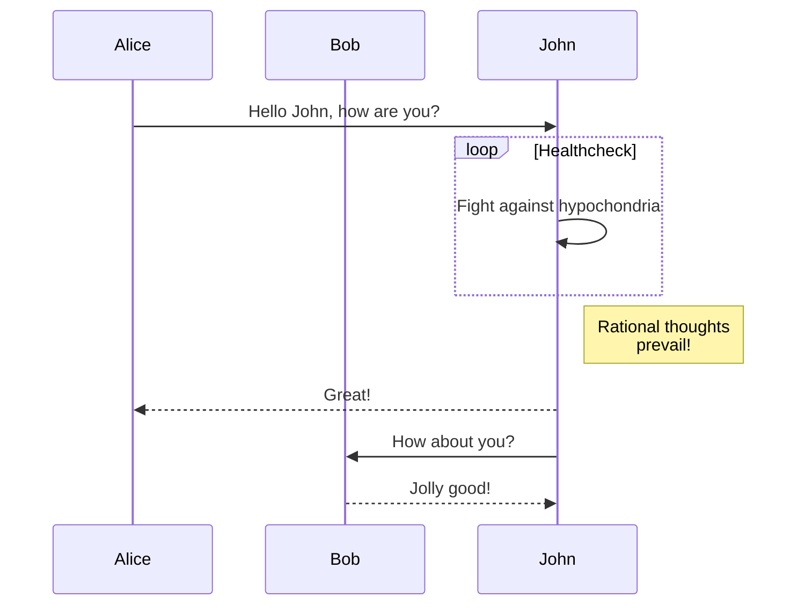
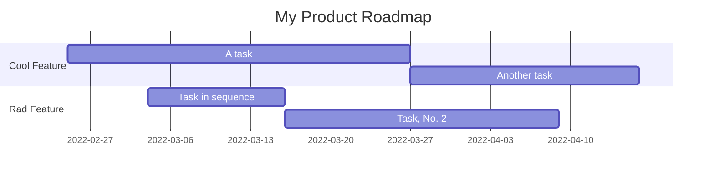

# h1 Heading 8-)

## h2 Heading

### h3 Heading

#### h4 Heading

##### h5 Heading

###### h6 Heading

## Typographic replacements

`+- (c) (C) (r) (R) (tm) (TM)`

+- (c) (C) (r) (R) (tm) (TM)

`!!!!!! ???? ,, -- ---`

!!!!!! ???? ,, -- ---

`example.. example... example..... example?..... example!....`

example.. example... example..... example?..... example!....

`"Smartypants, double quotes" and 'single quotes'`

"Smartypants, double quotes" and 'single quotes'

## Emphasis

_This is italic text_

**This is bold text**

~~Strikethrough~~

~~**_This is italic and bold text_**~~

## Blockquotes

> Blockquotes can also be nested...
>
> > ...by using additional greater-than signs right next to each other...

> > > ...or with spaces between arrows.

## Lists

Unordered

- Create a list by starting a line with `+`, `-`, or `*`
- Sub-lists are made by indenting 2 spaces:
  - Marker character change forces new list start:
    - Ac tristique libero volutpat at
    * Facilisis in pretium nisl aliquet
    - Nulla volutpat aliquam velit
- Very easy!

Ordered

1. Lorem ipsum dolor sit amet
2. Consectetur adipiscing elit
3. Integer molestie lorem at massa

4. You can use sequential numbers...
5. ...or keep all the numbers as `1.`

Start numbering with offset:

57. foo
1. bar

## Code

Inline `code`

Indented code

    // Some comments with indented code
    line 1 of code
    line 2 of code
    line 3 of code

Syntax highlighting

```typescript
function factorial(n: number): number {
  if (n === 0) {
    return 1
  }
  return n * factorial(n - 1)
}

const num: number = 5
console.log(`The factorial of ${num} is ${factorial(num)}`)
```

```python
def factorial(n):
    if n == 0:
        return 1
    else:
        return n * factorial(n-1)

num = 5
print(f"The factorial of {num} is {factorial(num)}")
```

## Tables

| Option | Description                                                               |
| ------ | ------------------------------------------------------------------------- |
| data   | path to data files to supply the data that will be passed into templates. |
| engine | engine to be used for processing templates. Handlebars is the default.    |
| ext    | extension to be used for dest files.                                      |

Right aligned columns

| Option |                                                               Description |
| -----: | ------------------------------------------------------------------------: |
|   data | path to data files to supply the data that will be passed into templates. |
| engine |    engine to be used for processing templates. Handlebars is the default. |
|    ext |                                      extension to be used for dest files. |

## Horizontal Rules

`---`

---

`___`

---

`***`

---

## Links

[link text](http://dev.nodeca.com)

[link with title](http://nodeca.github.io/pica/demo/ 'title text!')

Autoconverted link https://github.com/nodeca/pica (Auto linkify)

## Images


Image with title:


Like links, Images also have a footnote style syntax `![Alt text][id]`:

![Alt text][id]

With a reference later in the document defining the URL location:

`[id]: https://octodex.github.com/images/nyantocat.gif "Nyantocat"`

[id]: https://octodex.github.com/images/nyantocat.gif 'Nyantocat'

## Plugins

Very effective [syntax plugins](https://www.npmjs.org/browse/keyword/markdown-it-plugin) from `markdown-it`:

### [Emoji](https://github.com/markdown-it/markdown-it-emoji)

Classic markup:

`:wink: :cry: :laughing: :yum: :100: :dog: :cat:`

:wink: :cry: :laughing: :yum: :100: :dog: :cat:

Shortcuts (emoticons):

`:-) :-( 8-) ;)`

:-) :-( 8-) ;)

### [Subscript](https://github.com/markdown-it/markdown-it-sub) / [Superscript](https://github.com/markdown-it/markdown-it-sup)

- 19^th^
- H~2~O

### [Task lists](https://github.com/revin/markdown-it-task-lists)

- [x] Todo 1
- [ ] Todo 2

### [KaTeX](https://github.com/waylonflinn/markdown-it-katex)

$\sqrt{3x-1}+(1+x)^2$

$\sum_{i=0}^N\int_{a}^{b}g(t,i)\text{d}t$

$$
\begin{array}{c}
\nabla \times \vec{\mathbf{B}} -\, \frac1c\, \frac{\partial\vec{\mathbf{E}}}{\partial t} &
= \frac{4\pi}{c}\vec{\mathbf{j}}    \nabla \cdot \vec{\mathbf{E}} & = 4 \pi \rho \\
\nabla \times \vec{\mathbf{E}}\, +\, \frac1c\, \frac{\partial\vec{\mathbf{B}}}{\partial t} & = \vec{\mathbf{0}} \\
\nabla \cdot \vec{\mathbf{B}} & = 0
\end{array}
$$

$$
\begin{bmatrix}
{a_{11}}&{a_{12}}&{\cdots}&{a_{1n}}\\
{a_{21}}&{a_{22}}&{\cdots}&{a_{2n}}\\
{\vdots}&{\vdots}&{\ddots}&{\vdots}\\
{a_{m1}}&{a_{m2}}&{\cdots}&{a_{mn}}\\
\end{bmatrix}
$$

<br />

| Symbol |   Case (Lower/Upper)    | Symbol |   Case (Lower/Upper)    |
| :----: | :---------------------: | :----: | :---------------------: |
|   α    |   $\alpha$ - $\Alpha$   |   ν    |      $\nu$ - $\Nu$      |
|   β    |    $\beta$ - $\Beta$    |   ξ    |      $\xi$ - $\Xi$      |
|   γ    |   $\gamma$ - $\Gamma$   |   π    |      $\pi$ - $\Pi$      |
|   δ    |   $\delta$ - $\Delta$   |   ρ    |     $\rho$ - $\Rho$     |
|   ε    | $\epsilon$ - $\Epsilon$ |   σ    |   $\sigma$ - $\Sigma$   |
|   ζ    |    $\zeta$ - $\Zeta$    |   τ    |     $\tau$ - $\Tau$     |
|   η    |     $\eta$ - $\Eta$     |   υ    | $\upsilon$ - $\Upsilon$ |
|   θ    |   $\theta$ - $\Theta$   |   φ    |     $\phi$ - $\Phi$     |
|   ι    |    $\iota$ - $\Iota$    |   χ    |     $\chi$ - $\Chi$     |
|   κ    |   $\kappa$ - $\Kappa$   |   ψ    |     $\psi$ - $\Psi$     |
|   λ    |  $\lambda$ - $\Lambda$  |   ω    |   $\omega$ - $\Omega$   |
|   μ    |      $\mu$ - $\Mu$      |        |                         |

### [MerMaid](https://github.com/md-reader/markdown-it-mermaid#readme)





### [\<ins>](https://github.com/markdown-it/markdown-it-ins)

++Inserted text++

`++Inserted text++`

### [\<mark>](https://github.com/markdown-it/markdown-it-mark)

==Marked text==

`==Marked text==`

### [Abbreviations](https://github.com/markdown-it/markdown-it-abbr)

This is HTML abbreviation example.

It converts "HTML", but keep intact partial entries like "xxxHTMLyyy" and so on.

`*[HTML]: Hyper Text Markup Language`

\*[HTML]: Hyper Text Markup Language

### [Definition lists](https://github.com/markdown-it/markdown-it-deflist)

Term 1

: Definition 1
with lazy continuation.

Term 2 with _inline markup_

: Definition 2

        { some code, part of Definition 2 }

    Third paragraph of definition 2.

_Compact style:_

Term 1
~ Definition 1

Term 2
~ Definition 2a
~ Definition 2b

### [Footnotes](https://github.com/markdown-it/markdown-it-footnote)

Footnote 1 link[^first].

Footnote 2 link[^second].

Inline footnote^[Text of inline footnote] definition.

Duplicated footnote reference[^second].

[^first]: Footnote **can have markup**

    and multiple paragraphs.

[^second]: Footnote text.

### [Custom containers](https://github.com/markdown-it/markdown-it-container)

::: info
Stay hungry, stay foolish.
:::

::: tip
**In the middle of difficulty lies opportunity.**
:::

::: success
千里之行，始于足下。
:::

::: warning
_Fortune favors the bold._
:::

::: danger
**_Hic sunt dracones!_**
:::

### [Alert](https://github.com/mdit-plugins/mdit-plugins)

> [!NOTE]
> Useful information that users should know, even when skimming content.

> [!TIP]
> Helpful advice for doing things better or more easily.

> [!IMPORTANT]
> Key information users need to know to achieve their goal.

> [!WARNING]
> Urgent info that needs immediate user attention to avoid problems.

> [!CAUTION]
> Advises about risks or negative outcomes of certain actions.
